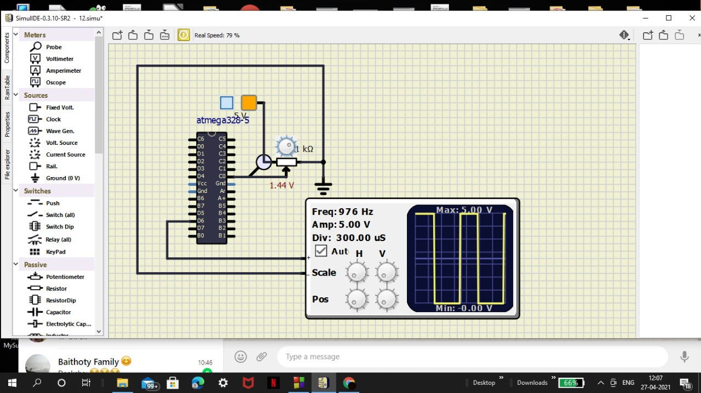
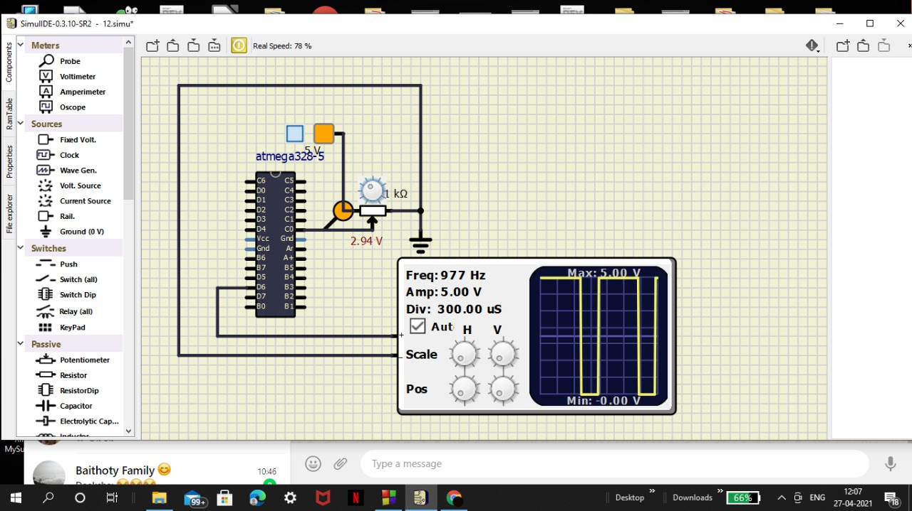
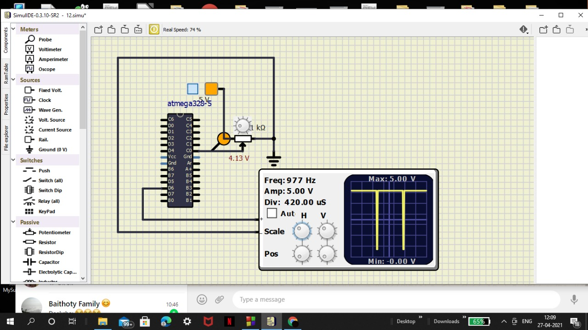

# Activity 3
## to generate pwm at different analog values
## Problem statement:
To generate different PWM for different analog reads
|analog values|PWM values|
|--- |--- |
|0-200|20%|
|210-500|40%|
|510-700|70%|
|rest|95%|
As explained in previous activities how at different voltages give different analog values
## Simulation proofs:
### for 20% pwm

### for 40% pwm
;
### 70% pwm

### 95% pwm

